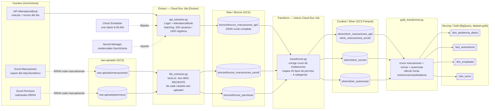

# Arquitectura del Proyecto — Control de Asistencia (GeoVictoria)

## 1. Resumen del problema

El proyecto construye un pipeline de datos para **control de asistencia del personal**,
cubriendo marcación de entrada/salida y refrigerios, turnos asignados, cálculo de
horas extras y horas nocturnas, faltas, y ausencias justificadas (vacaciones,
suspensiones, licencias). Las marcas se capturan mediante reloj biométrico a
través de **GeoVictoria**, integrando 3 fuentes reales: **API** (marcas + turnos,
método `AttendanceBook`), **Excel de marcaciones** (export del reloj) y **Excel
de permisos** (solicitudes de RRHH). El objetivo es consolidar estas fuentes en
un lakehouse en GCP (Bronze → Silver → Gold) para analizar cumplimiento de
turnos, horas trabajadas y ausentismo.

> Nota de evolución del diseño: el diseño original contemplaba CSV para turnos
> y texto plano para marcaciones. Se descartaron al descubrir que
> `AttendanceBook` ya trae el turno asignado en la misma llamada que las
> marcas, y que el export real de GeoVictoria llega como Excel, no texto
> plano — ver ADR `0002-data-model.md`.

---

## 2. Arquitectura lógica

**Flujo:** un único Cloud Run Job (imagen Docker) ejecuta Extract → Bronze →
Transform → Silver → Gold en una sola corrida, disparado diariamente por
Cloud Scheduler. La API es 100% automática; los Excel dependen de que RRHH
suba el export a `raw-uploads/`, pero el Job siempre toma automáticamente el
archivo más reciente sin intervención adicional.

---

## 3. Mapeo a servicios GCP

| Capa | Servicio GCP | Detalle |
|---|---|---|
| Cómputo (todo el pipeline) | **Cloud Run Job** (imagen Docker) | Extract + Transform + Load en una sola ejecución containerizada; corre igual en cualquier servidor Linux |
| Orquestación | **Cloud Scheduler** | Dispara el Job diariamente vía cron (`0 6 * * *`, zona `America/Lima`) |
| Registro de imágenes | **Artifact Registry** | Almacena la imagen Docker versionada |
| Raw (Bronze) | **Cloud Storage** | `gs://<bucket>/bronze/<tabla>/ingestion_date=YYYY-MM-DD/data.parquet` |
| Curated (Silver) | **Cloud Storage** | Mismo patrón de particionado, capa `silver/` |
| Serving (Gold) | **BigQuery** (dataset `gold`) | 4 tablas: `fact_asistencia_diaria`, `fact_ausentismo`, `dim_empleado`, `dim_turno` |
| Credenciales sensibles | **Secret Manager** | `GEOVICTORIA_API_KEY`/`SECRET`, inyectadas como variables de entorno al Job |
| Identidad/permisos | **Cuenta de servicio dedicada** | `python-data-pipeline@...` con roles Storage Object Admin, BigQuery Data Editor/Job User, Cloud Run Developer |
| Observabilidad | **Cloud Logging** (nativo de Cloud Run) | Logs estructurados por ejecución, visibles en la consola de Cloud Run → Jobs → Ejecuciones |

*(Nota: el diseño original contemplaba Dataflow/Dataproc para Transform. Se
simplificó a Python/Pandas dentro del mismo Cloud Run Job porque el volumen
real del proyecto —~250K marcas, ~2,100 empleados— no justifica la
complejidad operativa de un motor de procesamiento distribuido.)*

---

## 4. Riesgos y mitigaciones

| Riesgo | Impacto | Mitigación real aplicada |
|---|---|---|
| Límites de la API no documentados (200 usuarios / 1,500 registros por llamada) | Errores `OutOfLimitException` en producción | Batching automático de dos dimensiones (empleados × ventanas de 7 días) en `api_extractor.py` |
| Cruce de medianoche en turnos nocturnos | Horas trabajadas/nocturnas mal calculadas | Corrección automática en `transformer.py`: suma 1 día a la salida si su timestamp es anterior a la entrada |
| Excel de RRHH depende de un export manual | El Job no tiene datos nuevos si nadie sube el archivo | Carpeta `raw-uploads/` en GCS + auto-descubrimiento del archivo más reciente — reduce la intervención humana a solo "subir el archivo", sin coordinarse con el horario del Job |
| `silver_ausencias` y `silver_marcaciones` no comparten una llave real (nombre vs. `Identifier`) | Ausencias justificadas mal clasificadas como falta | Documentado y cuantificado (24% falta, ~40% match) en `dq_rules.md`; solución identificada (`User/List` vía OAuth) no implementada por tiempo |
| Credenciales expuestas accidentalmente (ocurrió durante el desarrollo) | Acceso no autorizado a GCS/BigQuery | Rotación inmediata de la clave comprometida + migración de credenciales de API a Secret Manager |

---

## 5. Observabilidad

- **Logs:** cada ejecución del Cloud Run Job genera logs estructurados
  (timestamp, nivel, módulo, mensaje) visibles en Cloud Logging, filtrables
  por ejecución individual desde la consola de Cloud Run → Jobs → Ejecuciones.
- **Métricas naturales del log:** filas leídas/escritas por capa, marcas
  corregidas por cruce de medianoche, solicitudes descartadas por estado,
  tipos de permiso sin mapeo — todo queda registrado como parte del flujo
  normal de ejecución, sin instrumentación adicional.
- **Estado de ejecución:** Cloud Run expone directamente si una ejecución
  completó todas sus tareas (`1/1`) o falló (`0/1`), visible en la consola sin
  necesidad de revisar logs para un chequeo rápido de salud del pipeline.