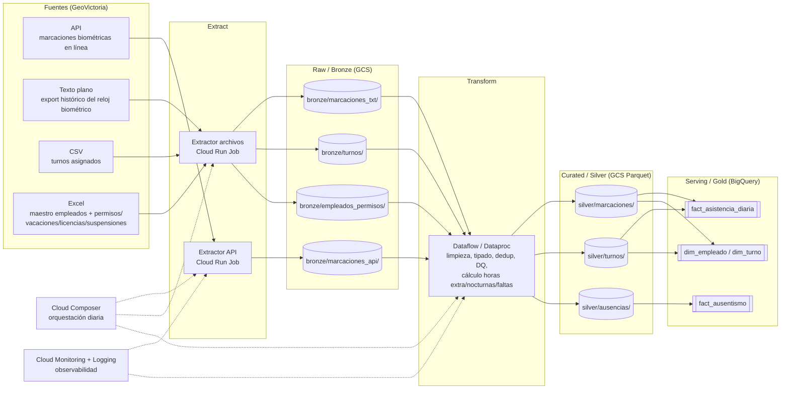

# Arquitectura del Proyecto — Control de Asistencia (GeoVictoria)

## 1. Resumen del problema

El proyecto construye un pipeline de datos para **control de asistencia del personal**, cubriendo marcación de entrada/salida y refrigerios, turnos asignados, cálculo de horas extras y horas nocturnas, faltas, y ausencias justificadas (vacaciones, suspensiones, licencias). Las marcas se capturan mediante **reloj biométrico (huella/rostro)** a través de **GeoVictoria**, que expone la información en múltiples formatos: **API**, **texto plano**, **CSV** y **Excel**. El objetivo es consolidar estas fuentes en un lakehouse en GCP (Bronze → Silver → Gold) para analizar cumplimiento de turnos, horas trabajadas y ausentismo.

---

## 2. Arquitectura lógica

**Flujo:** Sources (GeoVictoria: API, texto plano, CSV, Excel) → Extract → Bronze → Transform (incluye cálculo de horas extra, nocturnas y faltas) → Silver → Gold, orquestado diariamente por Cloud Composer, con observabilidad transversal vía Cloud Monitoring/Logging.

---

## 3. Mapeo a servicios GCP

| Capa | Servicio GCP | Detalle |
|---|---|---|
| Ingesta (API) | Cloud Run Job | Llama a la API de GeoVictoria para traer marcaciones biométricas (entrada/salida/refrigerio), maneja rate limiting y reintentos |
| Ingesta (archivos) | Cloud Run Job / Cloud Functions | Lee texto plano (export histórico del reloj), CSV (turnos) y Excel (empleados/permisos), valida formato antes de aterrizar |
| Raw (Bronze) | Cloud Storage (GCS) | Un prefijo por fuente, particionado por `ingestion_date` |
| Transform | Dataflow (Apache Beam) o Dataproc (Spark) | Limpieza, tipado, deduplicación de marcas, joins con turnos, cálculo de horas extra/nocturnas/tardanzas/faltas, reglas de calidad de datos (DQ) |
| Curated (Silver) | GCS (Parquet) | Particionado por `event_date`, esquema conformado |
| Serving (Gold) | BigQuery | Tablas de hechos y dimensiones para analítica de asistencia |
| Orquestación | Cloud Composer (Airflow) | DAG diario: extract → bronze → transform → silver → gold |
| Observabilidad | Cloud Monitoring + Cloud Logging | Métricas de duración de job, filas procesadas, alertas por fallo |

---

## 4. Riesgos y mitigaciones

| Riesgo | Impacto | Mitigación |
|---|---|---|
| Fallo de lectura biométrica (huella/rostro no reconocido) | Marca faltante → falsa "falta" | Cruce con Excel de permisos/licencias antes de clasificar como falta real |
| Rate limiting / caída de la API de GeoVictoria | Marcaciones del día no disponibles a tiempo | Reintentos con backoff exponencial, checkpointing por página, alertas |
| Cambios de esquema en el Excel de empleados/permisos (carga manual RRHH) | Fallos silenciosos en Silver | Validación contra `data_contract/schema` antes de promover a Silver, rechazo a cuarentena |
| Doble marcación o marca fuera de turno (error del reloj biométrico) | Cálculo erróneo de horas trabajadas/extra | Deduplicación por `(empleado_id, timestamp, tipo_marca)` y validación contra turno asignado en Transform |
| Desfase de zona horaria entre export en texto plano y API | Cálculo erróneo de horas nocturnas | Normalizar todo a UTC (o zona local fija) en Bronze→Silver, documentar convención en el contrato de datos |
| Permisos/vacaciones/licencias registrados tarde en el Excel | Faltas mal clasificadas temporalmente | Ventana de reproceso (backfill) al recibir actualizaciones del maestro de RRHH |

---

## 5. Observabilidad propuesta

- **Logs:** Cloud Logging centralizado por job (extract, transform), con `severity` y `run_id` correlacionado.
- **Métricas:** filas leídas/escritas por capa, duración de cada etapa, tasa de errores de DQ, % de marcas sin turno asociado — expuestas en Cloud Monitoring.
- **Alertas:** notificación (email/Slack vía Pub/Sub) si el DAG de Composer falla o si la tasa de nulos/marcas huérfanas supera un umbral.
- **Data Quality:** checks básicos (completitud, unicidad de llaves, rangos de fecha/hora, empleados sin turno) registrados como tabla `gold/dq_results` en BigQuery para trazabilidad histórica.
